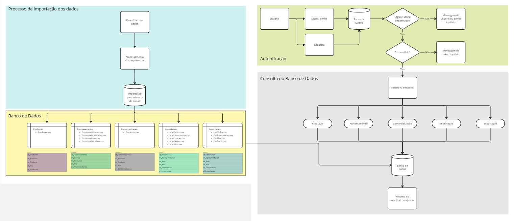
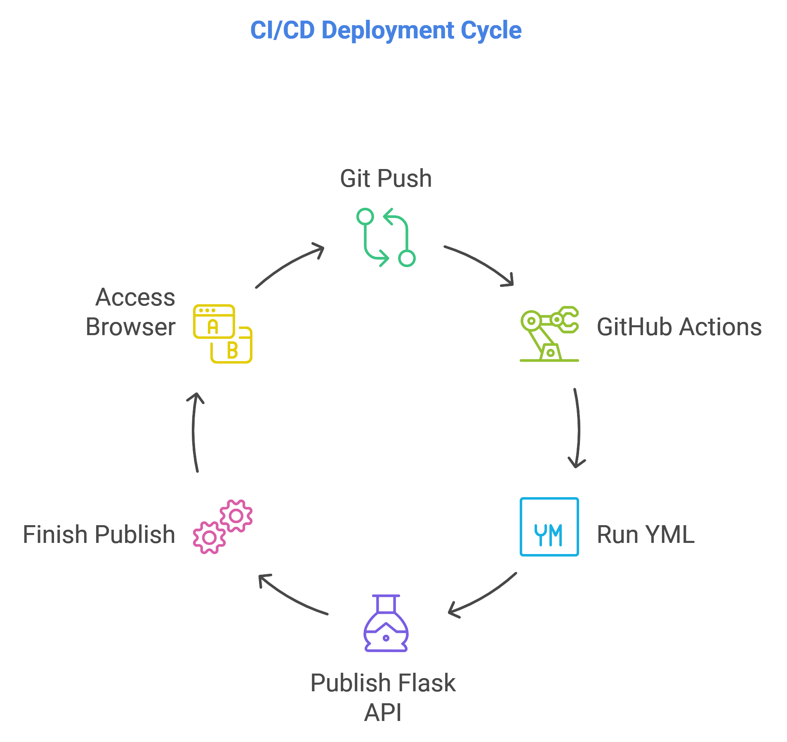

# Tech Challenge - API de Vitivinicultura

Este repositório contém o projeto desenvolvido como parte do **Tech Challenge**, uma atividade integradora que visa aplicar os conhecimentos adquiridos em diversas disciplinas. O objetivo é criar uma **API REST em Python** que consulta e disponibiliza os dados de vitivinicultura da **Embrapa**. Futuramente, essa API alimentará um modelo de **Machine Learning**, focado na análise e processamento de dados.

## Tecnologias Usadas 🛠️

- **Python 3.12** 🐍
- **Flask** 🌐
- **PostgreSQL** 🐘
- **Docker** 🐳 (**necessário para rodar o projeto**)
- **GitHub Actions** 🚀 
- **JWT** 🔑
- **Azure** ☁️

## Ambiente Necessário ⚙️

- **Python 3.12.7**: Instale a versão mais recente do Python [aqui](https://www.python.org/downloads/).
- **PostgreSQL**: Banco de dados para armazenar e consultar os dados. Instale-o [aqui](https://www.postgresql.org/download/).
- **Docker**: Necessário para rodar o projeto, criando e gerenciando containers da API e do banco de dados. Instale-o [aqui](https://www.docker.com/products/docker-desktop).
- **Git**: Para controle de versão e gerenciamento do repositório. Instale-o [aqui](https://git-scm.com/).

## Funcionalidades

- Consultas aos dados da Embrapa, incluindo:
  - Produção
  - Processamento
  - Comercialização
  - Importação
  - Exportação
- API documentada para facilitar o uso e integração.
- Suporte à autenticação JWT.
- Planejamento da arquitetura para ingestão de dados e deploy da API.
- MVP disponível com deploy em ambiente compartilhável.

## Objetivos do Projeto

1. **Criar uma API REST em Python** que consulte dados diretamente do site da Embrapa.
2. **Documentar a API** para facilitar sua integração por outros desenvolvedores.
3. **Implementar autenticação** (opcional, recomendada JWT) para proteger as rotas da API.
4. **Desenhar a arquitetura do projeto**, incluindo um plano de deploy e ingestão dos dados até a integração com um futuro modelo de Machine Learning.
5. **Deploy do MVP**, com um link compartilhável e um repositório no GitHub.
6. **Vídeo de 5 minutos**, apresentando o desenvolvimento do projeto e os resultados.

## Como Executar

1. Clone o repositório:
   ```bash
   git clone https://github.com/phenrike/tech-challenge-3MLET.git
   ```

2. **Executar a API e o banco de dados (necessário Docker instalado)**:

   - Para a versão mais recente do Docker (recomendada):

     ```bash
     cd ./tech-challenge-3MLET/
     cd ./docker/
     docker compose up --build -d
     ```

   - Para a versão legada do Docker (se você ainda estiver usando `docker-compose`):

     ```bash
     cd ./tech-challenge-3MLET/
     cd ./docker/
     docker-compose up --build -d
     ```

3. **Acessar a API no navegador**:
<http://127.0.0.1:8080/apidocs/>

4. **Parar a execução da API e do banco de dados**:

   - Para a versão mais recente do Docker (recomendada):

     ```bash
     docker compose down
     ```

   - Para a versão legada do Docker:

     ```bash
     docker-compose down
     ```

5. **Parar a execução da API e do banco de dados e excluir os volumes**:

    - Para parar e excluir os volumes adicione o parâmetro "-v":

        ```bash
        docker compose down -v
        ```
_________________________________________________________________________________________

## Documentação da API

Esta API não consulta dados diretamente no site do Embrapa, ela faz o download dos arquivos .csv disponibilizados pela empresa e os importa para um banco de dados.

### **Desenho da arquitetura: Fluxo do código**



### **Desenho da arquitetura: Fluxo do deploy**



### **Endpoint: Registro de usuário**

Somente usuários cadastrados no banco de dados podem acessar a API.

**Requisição:**

- URL: `api/register`
- Método: POST
- Parâmetros:
  - `username`: Nome do usuário.
  - `password`: Senha do usuário.

**Resposta:**

- Código `201` - 	Usuário registrado com sucesso no banco de dados

### **Endpoint: Autenticação**

A autenticação na API é feita através de JWT (Jason Web Token).

**Requisição:**

- URL: `api/login`
- Método: POST
- Parâmetros:
  - `username`: Nome do usuário.
  - `password`: Senha do usuário.

**Resposta:**

- Código `200` - Login efetuado com sucesso e JWT gerado
- Código `401` - Usuário ou senha inválidos

### **Endpoint: Comercialização**

Este endpoint permite a pesquisa de dados comerciais baseados em ano, produto ou tipo de produto.

**Requisição:**

- URL: `api/comercializacao`
- Método: GET
- Parâmetros:
  - `ano`: Ano de comercialização.
  - `produto`: Produto comercializado.
  - `tipo_produto`: Tipo de produto comercializado

**Resposta:**

- Código `200` - Dados retornados com sucesso
- Código `400` - Você deve fornecer um ano, produto ou tipo de produto
- Código `401` - Não autorizado

### **Endpoint: Produção**

Este endpoint permite a pesquisa de dados de produção baseados em ano, produto ou tipo de produto.

**Requisição:**

- URL: `api/producao`
- Método: GET
- Parâmetros:
  - `ano`: Ano de produção.
  - `produto`: Produto produzido.
  - `tipo_produto`: Tipo de produto produzido

**Resposta:**

- Código `200` - Dados retornados com sucesso
- Código `400` - Você deve fornecer um ano, produto ou tipo de produto
- Código `401` - Não autorizado

### **Endpoint: Processamento**

Este endpoint permite a pesquisa de dados do processamento baseados em ano, tipo da uva ou tipo de cultivo.

**Requisição:**

- URL: `api/processamento`
- Método: GET
- Parâmetros:
  - `ano`: Ano de processamento.
  - `tipo_uva`: Tipo de uva processada.
  - `tipo_cultivo`: Tipo de cultivo processado.

**Resposta:**

- Código `200` - Dados retornados com sucesso
- Código `400` - Você deve fornecer um ano, tipo de uva ou tipo de cultivo
- Código `401` - Não autorizado

### **Endpoint: Tipos Processamento**

Este endpoint permite a pesquisa dos tipos de uvas processadas no endpoint de processamento.

**Requisição:**

- URL: `api/tipos_processamento`
- Método: GET

**Resposta:**

- Código `200` - Dados retornados com sucesso
- Código `401`- Não autorizado

### **Endpoint: Importação**

Este endpoint permite a pesquisa de dados importados baseados em ano, país e tipo de produto.

**Requisição:**

- URL: `api/importacao`
- Método: GET
- Parâmetros:
  - `ano`: Ano da importação.
  - `pais`: País de importação.
  - `tipo_prod`: Tipo de produto importado.

**Resposta:**

- Código `200` - Dados retornados com sucesso
- Código `400` - Você deve fornecer um ano, país ou tipo de produto
- Código `401` - Não autorizado

### **Endpoint: Exportação**

Este endpoint permite a pesquisa de dados exportados baseados em ano, país e tipo de produto.

**Requisição:**

- URL: `api/exportacao`
- Método: GET
- Parâmetros:
  - `ano`: Ano da exportação.
  - `pais`: País de exportação.
  - `tipo_prod`: Tipo de produto exportado.

**Resposta:**

- Código `200` - Dados retornados com sucesso
- Código `400` - Você deve fornecer um ano, país ou tipo de produto
- Código `401` - Não autorizado

### **Endpoint: Tipos Importação e Exportação**

Este endpoint permite a pesquisa dos tipos de uvas importadas/exportadas no endpoint de importação/exportação.

**Requisição:**

- URL: `api/tipos_importacao_exportacao`
- Método: GET

**Resposta:**

- Código `200` - Dados retornados com sucesso
- Código `401` - Não autorizado

_______________________________________________________________
### Cenário de utilização da API

A proposta deste projeto é desenvolver uma API pública que consulta dados de vitivinicultura disponíveis no site da Embrapa, abrangendo as abas de Produção, Processamento, Comercialização, Importação e Exportação.
A API fará a coleta de dados do site da Embrapa e armazenará em uma banco de dados que será preparado para o treinamento de modelos de Machine Learning. Os modelos serão treinados para prever a demanda por diferentes tipos de vinhos em várias regiões geográficas, analisando padrões históricos e identificando tendências de consumo.
Vinícolas e distribuídos podem utilizar esses modelos a fim de otimizar a gestão de estoque e planejamento de produção, reduzindo custos e melhorando a eficiência na cadeia de suprimentos respondendo de forma mais rápida às mudanças no mercado.
